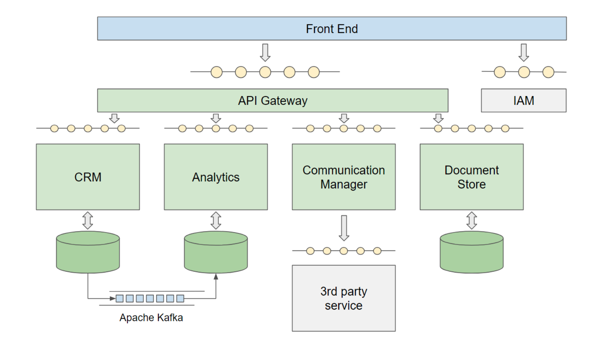

# Temporary Job Placement System  
A scalable microservices-based system for temporary job placement services.  

  

## 🚀 Project Overview  
This project is a **microservices-based** system designed to streamline temporary job placement services. It acts as a **Customer Relationship Management (CRM) tool** to enhance interactions between recruiters, candidates, and clients.  

With this platform, recruiters can efficiently manage **candidate profiles, job offers, interview scheduling, and document storage**, while ensuring secure authentication and inter-service communication.  

## ✨ Features  
- **🔍 Candidate Management** – Store and organize candidate profiles, resumes, and job applications.  
- **📑 Job Offer Tracking** – Create, manage, and track job offers through different recruitment stages.  
- **🤝 Customer Relationship Management** – Maintain client profiles and placement history.  
- **📂 Document Management** – Secure storage for contracts, resumes, and important documents.  
- **🔐 Secure Authentication** – OAuth2.0-based authentication and role-based access control (Keycloak).  
- **📡 Inter-Service Communication** – Event-driven architecture with Apache Camel.  
- **🛡️ API Gateway** – Single-entry point for secure request routing (Spring Cloud Gateway).  
- **📊 Monitoring & Logging** – Integrated with **Grafana, Loki, and Prometheus** for observability.  

Our project consists of multiple services, each providing specific functionalities and operating on designated ports.

- **Keycloak**: Runs on port `8080`. Acts as an API gateway, forwarding incoming requests to the microservices.
- **Crm**: Runs on port `8081`. Manages contacts, messages, and job offers. Communicates with the Communication Manager via Kafka.
- **Document Store**: Runs on port `8082`. Stores documents in a persistent way.
- **Communication Manager**: Runs on port `8083`. Retrieves and sends emails, and interacts with the Crm microservice.

## 🏗️ Tech Stack  
| Technology    | Purpose  |  
|--------------|---------|  
| **Spring Boot** | Backend framework for microservices  |  
| **Kotlin** | Backend programming language |  
| **PostgreSQL** | Database for storing system data  |  
| **Docker & Docker Compose** | Containerization and service orchestration  |  
| **Keycloak** | OAuth2.0 authentication & user management |  
| **Apache Camel** | Inter-service communication |  
| **React** | Web-based admin dashboard |  
| **Grafana, Loki, Prometheus** | System monitoring & logging |  

---

## 🛠️ Installation & Setup  

To run the entire project, follow these steps:

1. **Build and Run Docker Compose**:
    - It's present in the root directory a docker-compose, it's able to run: the keycloak realm, a simple single page application developed in React and Kafka.
2. **Start the microservices individually**
   - You should start keycloak first, after that all images in the container are running
   - Then you can start the other applications

